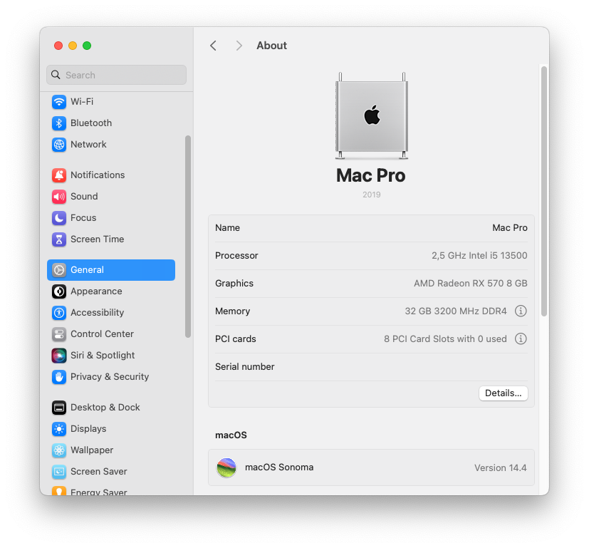
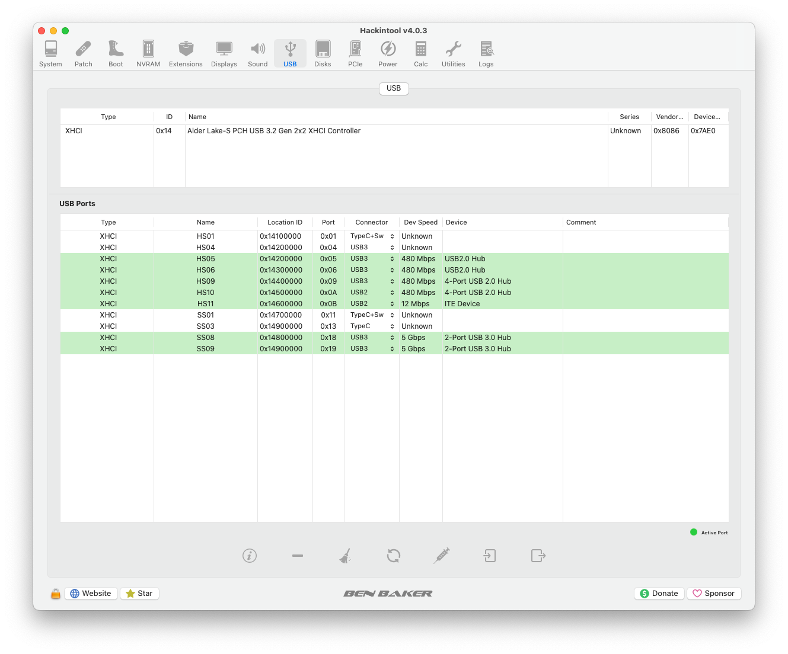
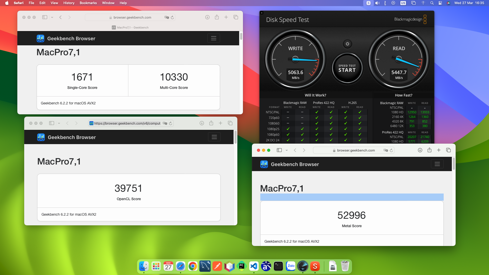

<h1>I5 13500 B660M Arous Pro Ddr4 Rx 570 8GB</h1>

    
    
    
    
    
    

## Warning ⚠️

<b>You should follow <a href="https://dortania.github.io/OpenCore-Install-Guide/"> Dortania Guides </a> for deeply understand.</b>
 
<b>You need to fill your own SMBIOS using this <a href="https://dortania.github.io/OpenCore-Install-Guide/config.plist/comet-lake.html#platforminfo">guide</a></b>
 
<b>I am not responsible for any damages you may cause.</b>

## Specs
- <b>CPU</b>: Intel(R) Core(TM) i5-13500 @ Base 2.5Ghz - Turbo 4.8Ghz - Cache 24MB
- <b>MOTHERBOARD</b>: Gigabyte B660M AORUS PRO DDR4
- <b>IGPU</b>: Intel® UHD Graphics 770 (**Disabled** in boot-args)
- <b>GPU1</b>: MSI GeForce RTX™ 3060 Ti GAMING X 8G LHR (**Disabled** in DeviceProperties)
- <b>GPU2</b>: SAPPHIRE PULSE Radeon RX 580 8GB 2048SP (**vflash to RX 570 8GB bios**)
- <b>RAM</b>: 32 GB(16x2) 3200MHz DDR4
- <b>SSD1</b>: Gigabyte AORUS Gen4 7000s SSD 1TB
- <b>SSD2</b>: Gigabyte AORUS Gen4 7000s SSD 1TB
- <b>AUDIO</b>: Realtek ALC897
- <b>ETHERNET</b>: Intel Ethernet I-225V
- <b>BIOS VERSION</b>: F28

## Bios settings

<b>Tweaker</b>
- `Extreme Memory Profile` **Profile 1**
* `Advanced Cpu Settings ->`
    - `Hyper-Threading Technology` **Enabled**
    - `Intel Turbo Boost Technology` **Auto**

<b>Settings</b>
* `IO Ports ->`
    - `Initial Display Output` **PCIe 2 Slot** (**PCIe 1 Slot** if your system has 1 GPU)
    - `Above 4G Decoding` **Disabled** (add **npci=0x2000** to boot-args)
    - `Above 4G MMIO BIOS assignment` **Disabled** 
    - `Super IO Configuration -> Serial Port` **Disabled**

    - `USB Configuration ->`:
        - `XHCI Hand-off` **Enabled**
        - `Legacy USB Support` **Enabled**
        - `USB Mass Storage Driver Support` **Enabled**
        - `Port 60/64 Emulation` **Disabled**

    - `Network Stack Configuration -> Network Stack` **Disabled**
* `Miscellaneous ->`
    - `Intel Platform Trust Technology(PTT)` **Disabled**
    - `Vt-d` **Enabled**

<b>Boot</b>
- `CFG Lock` **Disabled**
- `Fast Boot` **Disabled**
- `CSM Support` **Disabled**
- `Secure Boot` **Disabled**

## USB Mapping

## Status

<b> What's working? ✅ 

 

| Feature                                | Description          |
| :------------------------------------- | ---  |
| CPU Power Management                   | Good |    
| RX 570 8GB Graphics Acceleration                  | Good |
| Audio                                    | Good |
| All USB Ports                          | Good |
| Ethernet Port                          | Good |
| Sleep/Wake                             | Good |
| Shutdown/Reboot                        | Good |
| DRM                                    | Good |

<b> What's not working❗

 
<b>Everything looks perfect for now</b>

<b> Not tested 🔄

 

| Feature                               | Description          |
| :-----------------------------------  | -------------------- |
| AirDrop, HandOff, SideCar             | Need Apple compatible Wifi/Bluetooth card  |
| iServices                             | Need `Valid` Serial |
| BootCamp                              | Dual boot Win/Mac  |

## Benchmarks

## Credits
- [Apple](https://apple.com) for MacOS.
- [Acidanthera](https://github.com/acidanthera) for their hackintosh work.
- [Dortania](https://dortania.github.io/OpenCore-Install-Guide/) for great and detailed guides